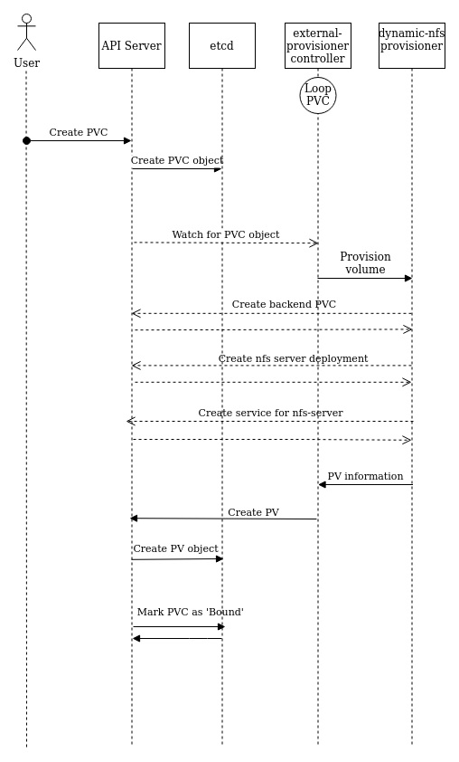
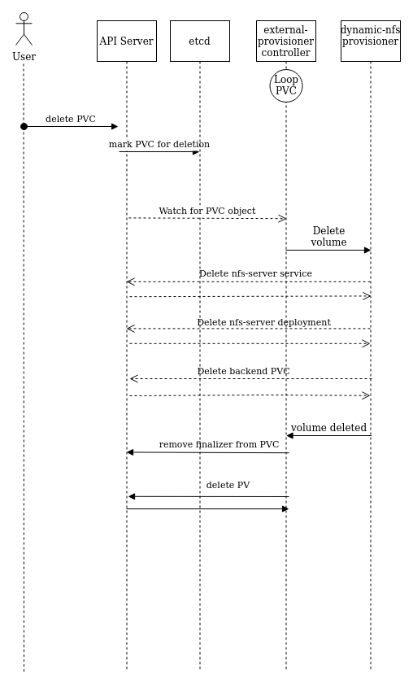

# Dynamic NFS Provisioner Workflow

## Overview
Dynamic NFS Provisioner provides a way to provide shared storage to Kubernetes containers. Dynamic NFS Provisioner uses NFS utilities to expose Kubernetes Volume
which can be mounted in different or same node machine using NFS Client.
This document describes volume provisioning and deletion flow for Dynamic NFS Provisioner.

## Provisioning
Below diagram describe the NFS Volume provisioning workflow.

## Delete
Below diagram describe the NFS Volume deletion workflow.

